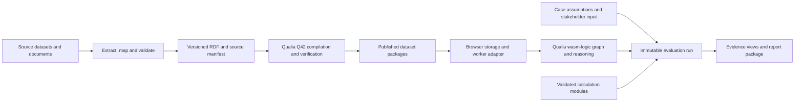

# 01 — QualiaDB runtime and Q42 architecture

## Target architecture



The browser UI is responsible for forms, navigation, accessible charts and report presentation. Qualia supplies the semantic execution layer. A storage adapter manages browser persistence. Versioned calculation modules consume explicit inputs and produce values with provenance. The same result contract applies whether a calculation initially runs in the workbook evaluator or later uses a Qualia scientific function.

## Profile and package selection

Use `qualia-core-db --no-default-features --features wasm-logic` as the target feature selection. In the inspected Cargo file, `wasm-logic` includes `wasm-scientific`, and the latter includes `gpu-runtime`. Consequently, “logic” is not a promise of a minimal CPU-only binary. Measure the actual artifact, imports, exports and runtime requirements.

The `wasm-ontology`/`webizen-lite-wasm` package is useful for small ontology interactions but is not the primary evaluation engine. Its session API explicitly loads Q42L and rejects native Q42 v3; its documented SPARQL subset is much narrower than the query surface tested through the existing full bundle. Do not select it solely for its download size.

The checked-in civics bundle is profile `full`, despite its currently narrow use. Replace it with a reproducibly built logic artifact only after equivalence and capability checks pass. Preserve its licence and build provenance with the package. Do not infer that every API mentioned in the native README is exported by the chosen browser build.

Required runtime manifest fields:

```json
{
  "schemaVersion": "civics-runtime/1",
  "engine": "qualia-core-db",
  "engineVersion": "<pinned version>",
  "sourceCommit": "<pinned commit>",
  "profile": "wasm-logic",
  "wasmSha256": "<artifact digest>",
  "bindingSha256": "<matching JS digest>",
  "q42Formats": ["<verified format and version>"],
  "testedCapabilities": ["<capabilities with passing fixtures>"],
  "buildRecipeVersion": "<recipe identifier>"
}
```

Feature flags are build declarations; `testedCapabilities` records observed behaviour. Mismatched JS/WASM artifacts, unsupported formats and untested required operations must produce explicit diagnostics.

## Observed SHACL boundary (checked-in browser artifact)

The checked-in `qualia-core-db` 0.0.39 browser bundle reports profile `full` and the capability label `shacl-property-validation`. It exposes `validate_shacl_constraint_wasm`, which has been executed for `minInclusive` and `maxInclusive` numeric constraints. This is useful for a small, typed predicate check; it is not a general SHACL interface.

The local Qualia source contains a broader graph-level SHACL engine: it can form a graph from N3/N-Triples plus a compact JSON shape specification and produces a validation report. That path supports cardinality, numeric ranges, datatype, class, node kind, string, property-pair and several logical constraints. The same source also contains MCP-facing property checks and extended deontic/epistemic constraints. However, the checked-in JS/WASM binding does not export the graph-level `validate_json` interface, does not accept RDF/Turtle `sh:NodeShape` documents for execution, and does not emit the standard report contract required by this application.

Consequences for Civics:

| Requirement | Status now | Required before using it as an admission gate |
|---|---|---|
| Store SHACL shapes as RDF | Present in `ontology/evaluation.ttl` | Keep shapes versioned with the dataset package |
| Structural release checks | Implemented as explicit JavaScript checks plus Turtle/SPARQL parse tests | Retain as the authoritative release gate until a tested semantic adapter supersedes it |
| Numeric SHACL predicate checks | Browser export observed | Use only behind a typed adapter with pass/fail/error fixtures |
| Graph validation from shapes and data | Present in local source, not exposed in shipped bundle | Export a stable browser function, define Turtle/JSON shape conversion, return focus node/path/component/severity/source shape and test failures |
| SHACL-SPARQL, custom components and full SHACL Core conformance | Not established | Do not claim support; establish each required component with independent fixtures |

`ontology/evaluation.ttl` deliberately contains `sh:NodeShape` resources, but the current validators only parse them as RDF; they do not execute them through Qualia. A shape declaration is therefore a model contract today, not evidence of browser-side shape conformance. The adapter in this plan must report unsupported constraint components explicitly and fail the relevant publication or decision gate rather than silently accepting them.

## RDF → Q42 compilation

1. Fetch or import an exact source release. Record retrieval time, original URL, release date, licence, bytes/hash and any access conditions. Preserve the source separately from interpreted statements.
2. Extract tabular or document observations with exact table/cell/page locators. Record extraction and mapping versions. Review ambiguous interpretation before admitting it as a model input.
3. Normalise identifiers, units, geography, reference periods and classifications into canonical RDF. Preserve original values and representations. Do not strip literals: currencies, dates, estimates, caveats and source titles matter.
4. Validate shapes and dataset-specific invariants. Keep rejected or incomplete records in a review area with reasons; never silently coerce them into eligible observations.
5. Compile through a pinned Qualia importer/writer. The local CLI exposes `Import`, `VerifyGraph`, and Q42 inspection/verification actions. Verify the exact release command and input-format support in a fixture before adopting a build recipe. The `Compile::N3ToDeontic` handler inspected during discovery only prints a message; it is not an RDF-to-Q42 pipeline.
6. Verify the volume and RDF equivalence, including lexical values, datatypes, language tags, blank nodes, contexts and identifiers. Verify rule metadata and provenance separately from graph-set equality.
7. Build a browser package with manifest, Q42 bytes/segments, schema/rule versions, source catalogue and reproducibility receipt. Test it through the exact browser reader that will ship.
8. Publish only the appropriate public dataset package. Keep restricted project evidence and personal records in separate authorised stores. Bundle source excerpts only where redistribution is allowed.

Q42 v3 is the preferred compilation target where the selected browser profile can consume it with the required semantics. If the browser binding needs work, implement that binding as an explicit Qualia dependency. An interim RDF snapshot may keep development moving, but it must not be represented as completion of Q42 integration.

## CBOR-LD interchange boundary

CBOR-LD is the likely binary interchange and ingest format for this integration. The inspected browser binding exposes `parse_cbor_ld_wasm` and `QualiaStore.insert_from_cbor_ld`; the current binary gate expects a CBOR array of four or five lexicon-compressed unsigned 64-bit identifiers for subject, predicate, object, context and optional metadata. This maps efficiently to NQuin storage and is the appropriate starting point for a package adapter once its framing and lexicon contract are pinned.

The native source makes a material distinction: Q42 volumes carry the indexed NQuin graph and Q42LEX lexicon, while CBOR-LD is a compact projection/interchange format that uses that lexicon for term resolution. Treat CBOR-LD as the canonical **transport and staged-ingest representation**; do not call an arbitrary CBOR document a Q42 dataset. Preserve a readable RDF representation during mapping and review, compile a versioned CBOR-LD package using a pinned context/lexicon, and verify the decoded quins against the source release before it can become a model input. Generate or accept a Q42 volume only after the browser reader, lexicon resolution, query behaviour and round-trip fixtures are demonstrated for the selected profile.

The current WASM parser is deliberately narrow: it accepts the compact identifier array and produces one quin. It does not yet demonstrate general JSON-LD-to-CBOR-LD transformation, context fetching, multi-graph package streaming, canonicalisation, digital-signature verification or arbitrary RDF/Turtle shape ingestion. Those belong in the Civics package adapter and its conformance fixtures, not in assumptions about the capability label.

## Format boundaries that must be resolved

| Surface | Observed meaning | Integration consequence |
|---|---|---|
| Unified Q42 v3 | `Q42\0`, 256-byte header, integrated lexicon/indexes/compressed blocks in inspected volume source | Use a compatible reader and verify every required semantic field survives |
| Q42L | Separate `Q42L` magic/version for the lite package's bounded session graphs | Explicit conversion contract; never rename a Q42L file and call it unified Q42 |
| Packed SuperBlocks | WASM packing API returns 40,960-byte blocks of 48-byte NQuins plus headers | A valid packed block is not by itself a complete indexed Q42 v3 dataset |
| `QualiaPortal.load_q42` / `WebEngine.load_q42` | Existing browser exports associated with scene/viewport surfaces | Method name is insufficient evidence of a general, persistent semantic query store |
| `WasmHealthStore` | Tested in-memory Turtle ingestion and SPARQL queries in existing bundle | Useful discovery tool; Q42, persistence and rule execution were not established by that test |
| `compileGgufToQ42` | Local source delegates to the P64 model-weight conversion path | Never use it to compile RDF evidence datasets |

The reader/writer contract must preserve u64 identifiers exactly: BigInt, decimal strings or typed binary fields. The old `QualiaStore` wrapper returns some query results as `Float64Array`; investigate and test values above 2^53 before using that path. Do not rely on ordinary JavaScript numbers for hashed identifiers.

## Browser adapter contract

Define an application interface rather than spreading raw exports throughout `model-app.js`:

| Operation | Required behaviour |
|---|---|
| `capabilities()` | Return manifest and observed availability, including unsupported operations |
| `openPackage(manifest, bytes)` | Verify hashes/format, load a dataset version, return a dataset handle |
| `query(handle, queryId, bindings, budget)` | Execute registered queries with typed parameters and bounded results |
| `validate(handle, shapesVersion)` | Return structured violations and validation coverage |
| `reason(runId, ruleSet, budget)` | Return conclusions, premises, counterevidence, completion status and rule trace |
| `snapshot(caseId)` | Freeze datasets, assumptions, rules and calculation inputs |
| `cancel(requestId)` | Stop or isolate long work without leaving a partially accepted run |
| `close(handle)` | Release Rust objects and browser resources predictably |

Responses must distinguish success, unsupported capability, invalid input, incomplete computation, timeout and storage failure. A timeout cannot become “no evidence found” or “rule passed.” Do not interpolate user text into executable query strings; use bindings or an allowlisted query template layer with proper term encoding.

## Workers, storage and offline operation

Run graph queries, compilation of small imports and expensive calculations in dedicated workers. Use asynchronous request IDs, cancellation, work budgets and progress messages. Share immutable dataset buffers where supported; avoid duplicating entire graphs in each module.

Persist public dataset packages and case snapshots through an OPFS/IndexedDB adapter with atomic version activation, migration receipts and an export/restore path. Keep `localStorage` only for small preferences and legacy migration. Request persistent storage where supported, but treat it as a request rather than a guarantee; quota loss must be recoverable.

The inspected `wasm_storage.rs` describes worker use but calls `window()` for storage access. A dedicated-worker OPFS path therefore needs source-level verification and potentially an adapter change. Start with host-managed byte storage behind the interface; do not assume an existing export works inside a worker.

Cache application code, WASM, schema/rules and selected data packages for offline runs. Fetch new releases into a separate staging area, verify them and explicitly activate them for new runs. Issued reports stay pinned to their original datasets. Offline reports show the dates and versions they used.

Retain readable pages and existing calculators when advanced capabilities are unavailable, with an explicit indication that semantic checks did not run. GPU availability should not be a prerequisite for ordinary case entry or reading an issued report. Test scientific CPU paths rather than assuming them from feature names.

## Numerical and logic integration

Keep calculations deterministic and independently testable. Version units, price bases, rounding, calendars and discount timing. Move a workbook calculation into Qualia only when baseline, boundary and sensitivity fixtures match within documented tolerances. Deterministic scientific calculations do not make their empirical inputs certain.

Modal logic must return domain-relevant traces. A rule result can establish that a model condition is satisfied under stated premises; it cannot establish the truth of an unverified premise or grant a real-world approval. The current `enforce_rights_ontology` helper inspected in local source is a non-zero-ID placeholder. It is not an acceptable implementation of a decision or rights gate.

## Operational requirements

Record dataset version, runtime profile, query/rule version, computation budget and completion status in each execution receipt. Exclude private evidence content from telemetry. Introduce release rollback and dataset rollback independently. Pin source commits and artifact hashes: the local project and site both use 0.0.39 labels, which alone do not prove build equivalence.

Set performance targets after profiling small, regional and multi-case packages on an ordinary laptop and a constrained mobile device. Measure cold download/init, load, query, rule, calculation, peak memory and report generation separately. Q42 compression, index pruning and lower memory use are hypotheses to measure for these datasets, not assumed benefits to insert into the investment model.
