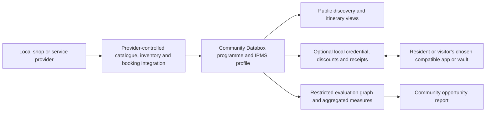

# 09 — Solid Databox integration for community commerce

The concrete reference implementation for this programme is [Solid-Databox-webcivics](C:/Projects/Solid-Databox-webcivics), not a hypothetical generic Solid service. It is an organisation-side, relationship-specific Databox platform built by extending Community Solid Server 7.1.9. Its documented Solid surface uses LDP, Solid-OIDC and WAC; its Databox layers add program/relationship isolation, governed two-way exchange, policy checks, append-only evidence and signed receipts.

The implementation already contains IPMS modules for POS, catalogue, pricing, promotions/discounts, loyalty, barcode, EFTPOS/payments, inventory, bookings, events, feeds, credentials, consumer rights, provenance, notifications, integration connectors, accessibility and web rendering. These are reusable capability candidates for a community programme. They are not a claim that every module is configured, locally appropriate, production-ready or independently interoperable in a particular town.

## Programme architecture

Public listings, tourism discovery and itinerary views belong in an explicitly approved public-presence layer. They must remain separate from relationship Databoxes, customer mappings and sensitive transaction/credential records. A provider chooses what is listed and may update or withdraw it. The community model records the inventory's provenance, consent, refresh date, category coverage and accessibility; it does not scrape or infer a provider's commercial information.

## Capability mapping

| Community capability | Existing Databox candidate | Required local design and evidence |
|---|---|---|
| Online shop and ordering | Catalogue, menu, POS, pricing, payments and receipt modules | Merchant agreement; product/inventory source; payment provider; tax/refund/consumer support; accessibility and operating support |
| Stock and fulfilment | Inventory, barcode, POS edge and integration/ODBC/R2RML modules | Source-of-truth decision; synchronisation/exception policy; staff training; offline/recovery and security test |
| Tourism discovery and itineraries | Catalogue, business, events, bookings, feeds, website/public renderer and notification modules | Provider-approved public inventory; availability/booking semantics; traveller accessibility; update cadence; no hidden ranking or exclusive placement |
| Local discounts | Pricing, promotions, discounts, loyalty and credential modules | Public eligibility and fairness policy; consent/minimal data; issuer/verifier roles; offline alternative; complaints, appeal, expiry and misuse controls |
| Consent-based data portability | CSS LDP/Solid-OIDC/WAC and Databox governed exchange | Exact protocol/version/profile; program-specific access policy; explicit consumer submission; no general reading of a person's independent Pod |
| Evidence and reporting | Provenance, policy, receipt, review and integration modules | Aggregation/de-identification; stated purpose; retention/access rules; model/run mapping; independent review where required |

## Data and authority boundary

A local organisation program creates an opaque, relationship-specific Databox. It can deposit approved records, notices, receipts, menus, vouchers and service information. A person can deliberately return an order, correction, preference, claim or selected fact. A submitted record is an explicit disclosure; the organisation must not crawl or query a person's independent Pod. Accepted records remain append-only with correction/supersession links and receipts.

A local credential is a separate community policy, even where issued as a verifiable credential. It must not reuse a Databox connection credential as a generic loyalty or surveillance token. Minimum disclosure should be used for the relevant discount; transaction histories are not required for the town-level opportunity model. Any pricing differentiation needs clear participant-facing terms and a non-digital route so local benefit is not conditional on device ownership or data surrender.

## Interoperability and production gates

The Databox decision register sets an adopted standards-preservation rule: normal Solid clients should retain standard discovery, authentication, read, append and notification behaviour, while Databox rules can narrow but not broaden authorisation. Its independent-interoperability gate remains open: evidence is still required against at least two independent non-Databox client stacks and an external Solid-OIDC issuer. The repository also identifies production gaps including durable registries/storage, KMS-managed keys, production IAM, independent security review, legal-policy review and external interoperability evidence.

For every local deployment, record the exact repository commit/release, CSS/Solid profile, enabled IPMS modules, organisation/program configuration, test suite result, independent client/issuer result and outstanding risks. The community model's `interoperabilityConformanceRecorded` safeguard must remain false until that record exists. This keeps a valuable reference implementation distinct from an unsupported claim of deployed, independently proven interoperability.

## First pilot slice

Start with a small, community-owned provider catalogue: consented providers, categories, accessibility fields, contact/booking link, update path and public-display approval. Add one willing merchant's online shop/inventory connection and one voluntary service/experience booking path. Measure provider onboarding effort, content completeness, successful discovery, booking/order completion, support burden, provider fees and accessibility issues against a pre-pilot baseline.

Only after the public catalogue and core operations are stable should a local credential pilot be considered. Keep eligibility simple, publish the policy, run an offline option, and test with people who are not existing Databox users. The result should support a decision about continuing, changing or stopping the service; it should never presume that reducing an external platform's role is itself a public benefit.
