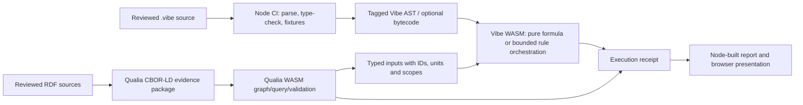

# 12 — QualiaDB/Webizen WASM development register

## Purpose

QualiaDB/Webizen WASM is an active development dependency. Civics should use its semantic, logic and scientific capabilities as they mature, through a pinned compatibility contract. A capability absent from the current browser artifact is an upstream implementation item, not a reason to discard the intended architecture.

This register distinguishes what has been observed in the checked-in 0.0.39 `full` bundle from the work needed to use it as the production evaluation runtime. It is deliberately framed as a development backlog for the QualiaDB/Webizen codebase and a matching integration contract for Civics.

## Present, usable surface

| Capability | Observed browser surface | Civics use now |
|---|---|---|
| RDF discovery graph | `WasmHealthStore.load_turtle` and SPARQL query | Parse and inspect the versioned ontology and source catalogue |
| Compact CBOR-LD quin ingest | `parse_cbor_ld_wasm`, `QualiaStore.insert_from_cbor_ld` | Controlled fixtures made of lexicon-compressed numeric quins |
| Logic/scientific functions | Full-profile exports for inference, statistics, numerical methods, units, geometry and selected economics functions | Explore behind individual typed adapters and independent calculation fixtures |
| SHACL property predicate | `validate_shacl_constraint_wasm` for numeric threshold checks | A narrowly scoped typed check only |
| Richer SHACL engine | Present in local Rust source as graph validation from N3/N-Triples plus compact JSON shape specs (`validate_shacl_json_wasm` / `validate_shacl_graph_wasm` / `get_shacl_capability_manifest_wasm`) | Source-complete for QW-04/QW-05 JSON shapes; still requires a pinned playground rebuild before Civics treats it as an admission gate |

## Upstream source sync — 25 September 2026

Status of QualiaDB/Vibe **source** (branch `0.0.39`) relative to this register. “Source-complete” means the Rust/WASM binding exists and has focused tests; it is **not** the same as “observed in the checked-in browser bundle” until a release rebuild pins digests.

### Preferred Civics package: `wasm-webcivics`

| Field | Value |
|---|---|
| Cargo feature | `wasm-webcivics` (`--no-default-features`) |
| `compiled_profile()` | `webcivics` |
| Artifact | `C:/Projects/qualia-27062026/docs/pkg/webcivics/qualia_webcivics_bg.wasm` |
| SHA-256 | `7c2de8203d6456a2ed852084f9e45dabf4647cd6ac990b0ca25cd7767c89cb71` |
| Size | 2,886,684 raw / 991,079 gzip |
| Excludes | `gpu-runtime`, WebGPU viewport, GGUF/LLM/MoE |
| Manifest | [profile.json](../../../data/web-civics-profile/profile.json) · Qualia `C:/Projects/qualia-27062026/docs/releases/0.0.39-wasm-digests.md` |

**Civics action:** wire `QualiaAdapter` / Node CI against this package, not `docs/playground` `full`. Re-run headless fixtures against the webcivics digests before treating SHACL/JSON-LD as browser-observed admission gates. Optional Q42 publish still waits on `compile-rdf-to-q42-wasm` (explicitly excluded from this profile).

| ID | Status | Evidence |
|---|---|---|
| VW-01 | Source-complete | `vibe-wasm`: `encode_program_cborld_wasm` / `decode_program_cborld_wasm` (Tag 4200); native round-trip test. |
| VW-02 | Source-complete (profile) | `VIBE_CBOR_LD_PROFILE = application/vnd.vibe.ast+cbor; version=0.1`; decode returns language/host version + AST hash. Package manifest digest pin still open for issued reports. |
| VW-03 | Source-complete (receipt core) | `eval_program_with_receipt_wasm` returns `sourceHash`, `astHash`, language/host version, profile. Budget/lease fields still thin versus full Civics receipt. |
| VW-04 | Partial | LocalHost now computes `Econ.gini`, `Econ.utilitarian_welfare` / `Econ.welfare`, `Econ.atkinson`, `Statistics.linear_regression` / `Statistics.ols`, `PhysicalUnits.convert` (incl. °C→°F). Ungranted catalog paths still fail closed with `E300`→Civics **E0403**. Full Civics lease subset + evidence-query binds remain open. |
| VW-05 | Done (Solid RDF pin) | `docs/tests/webcivics-solid-rdf.test.mjs` against `docs/pkg/webcivics` — Turtle / compact JSON-LD / N3 serialize→parse + Accept negotiation + Solid caps. Artifact SHA-256 `7c2de8203d6456a2ed852084f9e45dabf4647cd6ac990b0ca25cd7767c89cb71`. |
| QW-04 | Source-complete | `validate_shacl_json_wasm`, `validate_shacl_graph_wasm` in `wasm_bridge/semantic.rs` (present in `wasm-webcivics`). |
| QW-05 | Source-complete (JSON + Turtle compile) | Compact JSON `ShapeSpec` path + `get_shacl_capability_manifest_wasm` + `compile_shacl_turtle_wasm` / `turtle_shapes`. Re-pin browser observation against webcivics digests. |
| QW-07 | Source-complete (selected) | Receipted `calculate_welfare_metrics_wasm`, `calculate_leontief_multipliers_wasm`, `compute_ols_diagnostics_wasm` (`CalculationReceipt`). Typed TS contracts: Qualia `docs/contracts/qualia-engine-sdk.d.ts`. |
| QW-09 | Done (webcivics + Solid pin) | Digests + `wasm-webcivics` capability list + Solid MIME exports published; Civics `profile.json` pins artifact + `runtime.solid` + format completeness. Fixture: `webcivics-solid-rdf.test.mjs`. Remaining Civics-side: wire QualiaAdapter to this pin for admission SHACL observation. |
| SHACL text suite | Verified | `modalities::logic::shacl::text_input` — 5/5 passed after N3 decimal parser fix (incl. econ welfare/VaR constraints). |

**Civics action:** keep the 25 Sep demo audit rows below as the last *full-profile* browser-observed baseline; treat **wasm-webcivics** as the production target and re-run the headless suite against its digests. Qualia completeness tracker: `C:/Projects/qualia-27062026/docs/plans/utility-exposure-completeness-TRACKER.md`.

## Demo audit — 25 September 2026

The local sources behind the Webizen Compute Engine and Logic Showcase were inspected and their `docs/playground` WASM pair was executed directly. It identifies as `qualia-core-db` 0.0.39, `wasm32`, profile `full`.

| Demonstration | Finding | Civics interpretation |
|---|---|---|
| Compute Engine | The page dynamically loads `docs/playground/qualia_core_db.js` and its matching WASM binary, then invokes named exports. Direct calls returned correct-looking matrix multiplication (`[[58,64],[139,154]]`), descriptive statistics, OLS regression, `100 °C → 212 °F`, N3 static triple parsing and a numeric SHACL threshold result. | These are working, direct browser-WASM capabilities worth integrating through typed adapters and expected-result fixtures. |
| Logic Showcase: N3 arrows | Its arrow analysis is a JavaScript regular-expression helper. `parse_n3logic_wasm` is called for static triples. | The display of strict/defeasible/defeater/linear arrows alone is not proof that those authored N3 rules were parsed, compiled and executed by WASM. |
| Logic Showcase: forward chaining | `forward_chain_wasm` runs. On the showcase’s penguin fixture it returned both `flies` and `swims`, even though the interface describes `flies` as defeated. The local test suite itself labels defeater cancellation in this bridge as partial. | Do not use current browser forward chaining to enforce exception/defeater rules in a decision gate until QW-07 supplies a trace and the fixture is corrected. |
| Logic Showcase: SHACL | The page says that full shape enforcement runs on the native daemon after ingest, and browser WASM validates individual facets. Directly tested `minInclusive` succeeds; `pattern` returns an unsupported-constraint error. | The showcase does not claim, and does not demonstrate, browser execution of Civics’ RDF `sh:NodeShape` graphs. QW-04 and QW-05 remain required. |
| Local headless WASM suite | `node docs/tests/run-headless.mjs --mode wasm --show-skips` reported 500 passing assertions, 10 explicit skips and one failure. The failure was a Node relative-URL resolution error when opening a schema.org Q42 fixture, rather than a demonstrated numerical or logic result failure. | This is meaningful automated evidence for the shipped playground bundle. Resolve the fixture path, turn intended browser capabilities into non-skippable assertions, and run the suite on every pinned release. |

The Compute Engine page’s statement that the same solver code has “600+ native unit tests” was not independently verified by this audit. The executed result above is a browser-WASM test result and must be reported as such.

## Civics functional capability matrix

“Fully working” has a specific meaning here: a function has a typed input/output contract, units and scope where relevant, deterministic or seeded execution, known-error behaviour, passing and failing fixtures, a versioned receipt, and an explanation suitable for a decision report. An export name, an attractive demo, or a result that merely looks plausible is not sufficient.

| Area | What Civics needs it to do | Minimum fully-working contract | Current position | Required work |
|---|---|---|---|---|
| Semantic evidence and provenance | Ingest source releases; identify observations, assumptions, cohorts, place/time, units, confidence and limitations; trace report claims back to source locators. | RDF/CBOR-LD package round trip; preserved lexical values; Q42LEX context/digest; registered queries; source-to-result receipt. | Turtle/SPARQL discovery works; compact CBOR-LD primitive exists. | QW-01, QW-02, QW-03, QW-06, QW-08, QW-09. |
| SHACL and data admission | Reject an incomplete dataset release, an invalid observation, an unsupported constraint or an unfit calculation input before it influences a run. | Compile Civics’ RDF shapes; report focus node/path/component/severity; distinguish violation, warning, error and unsupported; validate browser and native equivalently. | Numeric facet helper only in browser; richer engine exists in Rust source. | QW-04, QW-05, QW-06. |
| Descriptive statistics and uncertainty | Summaries, quantiles, distributions, correlation, regression diagnostics, confidence intervals and sensitivity analysis for evidence and measured outcomes. | Explicit missing-data policy; sample/population convention; method and confidence level; numerical tolerances; expected-result fixtures; no causal interpretation inferred from correlation. | Representative descriptive statistics and OLS calls executed in the full WASM bundle. | QW-07 receipts/schemas and Civics method packs. |
| Economic and fiscal evaluation | Separate operator cash flow, government fiscal effects, social costs/benefits, distributional impacts, discounting, scenario/sensitivity and risk. | Price basis, currency, time period, discount rule, counterfactual, incidence, uncertainty method and no-double-counting controls; each ledger remains separately reportable. | Economics and finance exports exist; Vibe catalog lists pure economic functions. Their suitability for these policy questions is not established by presence. | QW-07 plus Civics economic method packs, independent formula-equivalence fixtures and report reconciliation. |
| Social outcomes and equity | Describe access, safety, wellbeing, service pathways, distribution by cohort and lived-experience evidence without turning personal hardship into a deterministic score. | Consent/access boundary; aggregate/disclosure rules; cohort definition; causal-strength label; qualitative evidence links; distributional results separate from monetary results. | Ontology and community model establish the categories and safeguards. | Semantic package work, SHACL admission, privacy/consent rules and report evidence views; no generic solver can supply this judgement. |
| Logic, rules and policy conditions | Evaluate transparent eligibility, readiness, safeguards, obligations, exceptions and evidence gaps with traces. | Authoritative rule representation; premises and counterevidence; defeater/priority semantics; rule version; bounded execution; trace/receipt; correct failure handling. | N3 static parsing and simple forward chaining work. Browser defeater result is demonstrably partial. | QW-07; use the native route only after its rule trace and parity fixtures pass. |
| Technical, engineering and resilience models | Check units; model energy, microgrid loads, metering, outages, infrastructure performance, capacity and maintenance scenarios. | Engineering scope, source input versions, physical units, solver method/tolerance, constraints, convergence/error status and independent benchmark cases. | Units and numerical/linalg functions are directly demonstrated; browser profile exposes further solvers. | QW-07 plus domain-specific engineering models and validation against recognised benchmarks. |
| Spatial/community opportunity analysis | Combine town/community indicators with opportunity, travel, facility and local capacity data without asserting a benefit that evidence cannot support. | Geography/classification version, denominator, reference period, boundary treatment, location uncertainty and clear aggregation rules. | Graph and geospatial exports are present; community-opportunity model preserves separate ledgers and readiness blockers. | QW-01–03, QW-07 and locality/geography method packs. |
| Simulation and scenarios | Compare transparent alternatives and sensitivity cases, including a seeded stochastic risk model where appropriate. | Scenario manifest, input deltas, random seed, number of trials, model domain, convergence/quality checks and distributional output. | A financial simulation export exists but requires its exact typed schema; the first ad-hoc invocation exposed that it does not accept the parameter names assumed by its test page. | QW-07 typed schemas/receipts, scenario registry and accepted use cases. |
| Reports and reproducibility | Produce a planning report that can be reconstructed and challenged later. | Frozen source package, shapes, rules, Vibe program if used, engine artifact, calculations, assumptions, outputs, reviewer decisions and human-readable narrative. | Existing model/report and source catalogue establish a baseline. | QW-02–09 plus Civics report/run package implementation. |

The first Civics release does not need every engine capability. It does need the complete contract for evidence admission, statistics, deterministic economic ledgers, units, rules/safeguards, sensitivity cases and report receipts. Specialist finance, game theory, pharmacology, chemistry or quantum functions are only included when a defined module has a valid decision use and fixtures.

## VibeScript and the Node site

The present Civics site is a Node-built static application. That is compatible with Vibe; Vibe does not need to replace Node. Node should remain the site build, static asset pipeline, test runner and package verifier. Vibe is suitable as a capability-bounded authored formula/rule layer, executed in its own WASM interpreter in the browser or under Node during build/CI tests.

The shipped `vibe-0.1` WASM package was executed in Node during this audit: `= 1 + 2` evaluated to `3`, source projection returned canonical formatted Vibe source, and the bytecode compile/encode/decode/run path also returned `3`. Its public WASM API currently exposes JSON AST projection and `vibe-bc-0.1` bytecode operations. The Rust crate additionally implements a tagged CBOR AST codec (`TAG_VIBE_AST = 4200`), but the shipped WASM bindings do not yet expose program-to-CBOR or CBOR-to-program calls.

### Recommended artifact boundaries

| Artifact | Canonical form | What it is for | Node role | Browser/WASM role |
|---|---|---|---|---|
| Evidence source and ontology | Readable RDF/Turtle plus original source snapshots | Review, mapping, diffs and recovery | Validate manifests and generate test fixtures | Display and inspect only as appropriate |
| Semantic dataset package | Versioned Qualia CBOR-LD profile plus Q42LEX/context manifest; optional Q42 indexed volume | Efficient evidence/query interchange | Build/check package hashes and compatibility | Load/query/validate through Qualia adapter |
| Vibe source | UTF-8 `.vibe`, LF-canonicalised and hashed | Human review, version control and authorship | Lint, type-check and fixture-test selected programs | Editable/auditable program view |
| Vibe canonical AST | Versioned tagged CBOR AST (`4200`) with explicit Vibe language and schema version | Compact, structure-preserving exchange of reviewed programs | Verify source-hash ↔ AST-hash mapping; package it as a distinct MIME/profile | Parse/decode/evaluate after binding support is published |
| Vibe bytecode | `vibe-bc-0.1` | Optional execution cache, never the sole authoritative source | Regenerate and compare against the reviewed source/AST in CI | Fast local execution where its semantics match the AST interpreter |
| Evaluation run/report | JSON/CBOR receipt envelope referencing immutable artifact digests | Reproducibility and readable report generation | Produce the presentation and validate completeness | Return typed results and execution receipts |

Keep Vibe CBOR AST separate from Qualia graph CBOR-LD. They are related semantic artifacts but answer different questions: the AST represents an authorised program; the dataset package represents evidence and graph content. Every envelope must declare its content type/profile, language/schema version, source/AST hash, engine artifact digest and capability profile. Never put an unlabelled CBOR blob into the model pipeline and infer its meaning from its bytes.

### Vibe integration pattern



Vibe should initially author only pure, deterministic calculations and explicitly bounded rule orchestration: for example, a published sensitivity formula, a transparent threshold/readiness rule, or a report section calculation that receives already-admitted typed inputs. It should not be used to store raw source data, bypass SHACL admission, silently call a native-only graph operation, or replace the Node presentation layer.

### Vibe updates needed for this architecture

| ID | Update | Acceptance condition | Upstream (25 Sep 2026) |
|---|---|---|---|
| VW-01 | Export `encode_program_cborld_wasm(source)` and `decode_program_cborld_wasm(bytes)` from the existing Rust AST codec. | Browser and Node build use the same tagged AST bytes for a fixture program; decode, project and type-check reproduce the reviewed program. | **Source-complete** (25 Sep 2026); pin + browser parity still required. |
| VW-02 | Define a versioned Vibe AST content type/profile, canonical hash rules, AST schema identifier and package manifest. | An issued report can name the exact source hash, AST hash, `vibe-0.1` dialect, host ABI and WASM digest. | **Profile + hashes in source**; package manifest digest pin open. |
| VW-03 | Expose checked AST/bytecode receipts: input bindings, capability lease/profile, budget, result, diagnostics and bytecode/AST hashes. | A report result is reproducible from its recorded Vibe package and typed inputs. | **Core receipt exported**; lease/budget enrichment open. |
| VW-04 | Bind the approved Civics capability subset: units, deterministic calculation registry, registered evidence queries and validation results. | Attempts to invoke an ungranted, native-only or unsupported capability fail with a structured diagnostic. | **Partial** — LocalHost econ/stats/units kernels bound; evidence queries open. |
| VW-05 | Establish Node/browser parity fixtures for pure cells and bounded modules. | Node CI and the shipping browser bundle produce identical result values and diagnostics for the registered fixture suite. | **Done for Solid RDF** (25 Sep 2026) — `webcivics-solid-rdf.test.mjs` on pinned `wasm-webcivics`. Broader econ/SHACL parity still Civics adapter work. |

This creates a coherent division: Node assembles and verifies the web application; Qualia handles semantic datasets, graph operations and scientific kernels; Vibe carries reviewable application logic; CBOR-LD carries versioned binary artifacts with explicit profiles; and the report ties all of them together with receipts.

## Format selection: JSON-LD first, binary by derivation

Yes: **JSON-LD 1.1 should be the primary web-facing semantic serialisation for Civics.** It fits the current Node/JavaScript site, maps to RDF through defined W3C processing algorithms, is human-reviewable in pull requests and can be transformed into standard RDF dataset forms. JSON-LD is appropriate for source mappings, public dataset releases, the semantic portion of an API, ontology examples and test fixtures. [JSON-LD 1.1](https://www.w3.org/TR/json-ld11/) is a W3C Recommendation designed to integrate Linked Data with ordinary JSON-based web systems.

Use a compacted, pinned JSON-LD context that ships inside every dataset package. Do not fetch a mutable remote context at report-run time. The package manifest must name the context URI, embed or hash its exact bytes, declare the JSON-LD processing mode and preserve full IRIs/datatypes in the expanded form used for validation.

| Need | Recommended format | Reason |
|---|---|---|
| Civics UI state, forms, calculations and report view models | Ordinary JSON with JSON Schema | These are application records, not linked-data graphs. Keep browser/Node code simple. |
| Semantic evidence, observations, ontologies, mappings and public interchange | JSON-LD 1.1 with pinned context; readable Turtle/N-Quads derivation | Best fit for Node/browser tooling, review and RDF interoperability. |
| Dataset hashes/signatures and graph equality | Canonical RDF dataset representation with RDFC-1.0 hash | A JSON text hash alone is not graph identity; RDF canonicalisation handles equivalent graph serialisations and blank nodes. [RDF Dataset Canonicalization](https://www.w3.org/TR/rdf-canon/) defines RDFC-1.0. |
| Offline/package transport once volume/bandwidth matters | CBOR-LD derived from the admitted JSON-LD graph, plus Q42LEX manifest | Binary efficiency without making a binary blob the authoring or audit format. [CBOR-LD](https://www.w3.org/TR/cbor-ld-10/) is designed to compact JSON-LD terms and typed values, but is currently a W3C Working Draft. |
| Qualia indexed storage | Q42 volume generated from the admitted graph/package | Engine-native query/index layer, not the format humans edit. |
| Vibe program | `.vibe` source and tagged Vibe AST; optional bytecode cache | Code has its own language/version semantics and should not be confused with evidence RDF. |

The sequence should therefore be:

```text
source release → mapped JSON-LD 1.1 → SHACL/admission → canonical RDF hash
               → derived CBOR-LD or Qualia binary package → optional Q42 volume
```

The current Qualia compact-array codec must **not** be labelled `application/cbor-ld` merely because it uses CBOR and linked-data identifiers. It needs to demonstrate conformance to the selected CBOR-LD profile and JSON-LD-context mapping. Until then, name it a Qualia vendor profile such as `application/vnd.qualia.nquin-cbor` and require an explicit bidirectional transform to the admitted JSON-LD/RDF graph. This avoids presenting a private compact encoding as a standards-compatible interchange format.

## Required QualiaDB/Webizen WASM updates

### QW-01 — publish one canonical CBOR-LD package profile

**Why:** The source currently contains two incompatible-looking paths. `serialize_to_cborld` writes a CBOR array of JSON-LD-shaped maps; the browser `parse_cbor_ld_wasm` and `QualiaStore.insert_from_cbor_ld` accept a compact array of four or five unsigned lexicon identifiers. The ingest stream also scans bytes for the next CBOR array header. These paths must be made explicit, versioned and round-trip compatible.

**Update the engine to:**

- select either W3C CBOR-LD conformance or a clearly named Qualia vendor profile; publish its profile URI/version, top-level framing and record boundaries;
- define the exact representation of subject, predicate, object, graph/context, metadata, parity, RDF-star terms, blank nodes, datatypes and language tags;
- declare whether maps, compact lexicon-coded arrays, or both are supported; if both remain, make the profile identifier mandatory and reject an unrecognised one;
- provide one streaming decoder that consumes the entire encoded item safely, rather than searching raw bytes for an array header;
- preserve lexical and inline-typed value semantics on encode/decode; and
- make the current serializer and browser decoder round-trip the same fixture set.

**Acceptance fixtures:** empty graph; repeated predicates; named graphs; strings; decimal/integer/boolean/date values; language tags; blank nodes; RDF-star statement; an identifier greater than `2^53`; malformed and truncated frames; source → CBOR-LD → WASM store → query equivalence.

### QW-02 — expose bulk CBOR-LD encode, decode and graph-load APIs

**Why:** A one-quin parser is insufficient for a dataset release, report snapshot or ontology package.

**Update the browser binding to provide:**

```ts
encode_cborld_wasm(quins: NQuinWire[], profile: string): Uint8Array
decode_cborld_wasm(bytes: Uint8Array, profile?: string): DecodeResult
load_cborld_wasm(store: GraphStoreHandle, bytes: Uint8Array, options: LoadOptions): LoadReceipt
```

`NQuinWire` must use `bigint`, decimal strings or binary fields for identifiers; ordinary JavaScript `number` is not safe for 64-bit hashes. `DecodeResult` and `LoadReceipt` must include a profile/version, count, warnings, source offset on failure and an explicit error code. The existing short-form parser can remain as an optimised primitive underneath this API.

### QW-03 — make the Q42 lexicon/context a first-class package dependency

**Why:** Compact CBOR-LD only has meaning when its term identifiers resolve consistently. The source already has Q42LEX and a CBOR-LD parser that uses a Q42 context, but the browser package boundary does not yet prove how that lexicon is supplied, pinned or verified.

**Update the engine to:**

- load a declared lexicon/context manifest before compact package records;
- expose stable lookup and collision/error behaviour to JavaScript;
- include lexicon digest, profile, Q42 format version and source engine commit in a package receipt; and
- fail closed on unknown context, digest mismatch or unresolved material terms.

**Acceptance fixture:** a package built by the native tool is read by the exact released JS/WASM pair and produces identical term identities and query results.

### QW-04 — expose graph-level SHACL validation to WASM

**Upstream (25 Sep 2026):** Source exports `validate_shacl_json_wasm` / `validate_shacl_graph_wasm` exist. Turtle shape compile API in the snippet below remains open. Re-pin browser artifact before Civics admission-gate use.

**Why:** The local source has `ShaclEngine`, structured `ValidationReport`/`ValidationResult`, standard and Qualia-native constraint types, plus a compact JSON entry point. The released bundle exposes only a numeric predicate helper. Civics needs the former for dataset, rule and run admission.

**Update the binding to provide a stable graph-validation API**, for example:

```ts
compile_shacl_shapes_wasm(shapes: Uint8Array, format: "text/turtle" | "application/cbor-ld"): ShapeCompileResult
validate_shacl_graph_wasm(data: Uint8Array, dataFormat: string, compiledShapes: ShapeHandle, options: ValidationOptions): ValidationReport
```

The report must preserve `conforms`, focus node, path, value, severity, source shape, constraint component, human-readable message, error versus violation, runtime/profile version and validation coverage. It must never convert an unsupported component into a passing result.

### QW-05 — implement an RDF SHACL-shape compiler and coverage manifest

**Upstream (25 Sep 2026):** JSON `ShapeSpec` + `get_shacl_capability_manifest_wasm` source-complete. RDF/Turtle `sh:NodeShape` compiler still required for Civics shapes.

**Why:** Civics’ shapes are ordinary RDF/Turtle `sh:NodeShape` documents. The current source convenience entry point takes a compact JSON `ShapeSpec`; it does not establish that an RDF SHACL document is compiled and enforced.

**Update the engine to:**

- parse Turtle and CBOR-LD shape graphs into the internal shape representation;
- support an explicit, versioned subset of SHACL Core first, with component identifiers and test fixtures;
- return `unsupported-component` for unimplemented SHACL Core, SHACL-SPARQL or custom components; and
- publish a machine-readable coverage manifest for each WASM build profile.

Initial Civics-required components are `targetClass`, `targetNode`, `path`, `minCount`, `maxCount`, `datatype`, `nodeKind`, `class`, `in`, numeric bounds, `pattern`, `minLength`, `maxLength`, `closed`, `node`, `and`, `or`, `not`, `xone`, severity and deactivation. SHACL-SPARQL is a later capability unless demonstrated with its own sandboxing, query budget and conformance fixtures.

### QW-06 — align parser, serializer, SHACL and graph-store semantics

**Why:** A model input may travel from readable RDF to CBOR-LD, then NQuins, then a graph store and SHACL evaluation. All four stages must agree on graph context, literal identity, RDF type, term resolution and error behaviour.

**Update the engine to run an end-to-end conformance suite** that creates one canonical semantic fixture, performs each conversion in browser and native builds, executes a registered query and validates at least one passing and one failing shape. The suite must run against the generated `.js` and `.wasm` artifacts, not only Rust unit tests.

### QW-07 — make logic and scientific operations typed, receipted and reproducible

**Upstream (25 Sep 2026):** Selected receipted exports land in source (`calculate_welfare_metrics_wasm`, `calculate_leontief_multipliers_wasm`, `compute_ols_diagnostics_wasm`) with `CalculationReceipt`. Typed contracts: Qualia `docs/contracts/qualia-engine-sdk.d.ts`. Rule-trace receipt for defeasible N3 remains open.

**Why:** The full bundle exports many promising capabilities, including defeasible inference, statistics, numerical solvers, units and economics functions. Export presence does not state input domain, numerical method, units, random seed, convergence status or a result trace.

**Update the engine to provide:**

- per-function input/output schemas and unit conventions;
- calculation receipts containing engine version, algorithm/method, tolerances, seed where stochastic, iteration/convergence status and warnings;
- deterministic fixtures for every function used in a decision report;
- an explicit error/unsupported result instead of `null`, `undefined` or an untyped exception; and
- traceable rule conclusions with premises, defeaters, counterevidence and execution budget.

For Civics, early targets are descriptive statistics, regression diagnostics, units, deterministic sensitivity arithmetic and scenario simulation. Finance-specific tools such as Black–Scholes or GBM are available for a defined financial risk module only; they must not be used to invent social or public value estimates.

### QW-08 — ship a browser Q42 package reader with graph semantics

**Why:** Q42 is the native indexed-volume layer. The present browser exports named `load_q42` surfaces, but those names do not yet demonstrate an openable, queryable, persistent evaluation graph with Q42LEX resolution.

**Update the engine to provide an explicit package reader** that verifies header/version/digest, opens Q42LEX plus graph indexes, exposes the same query and shape-validation semantics as a loaded CBOR-LD graph, and emits a resource receipt. Browser support must include safe lifecycle methods (`open`, `query`, `validate`, `close`) and clear unsupported/format-mismatch diagnostics.

### QW-09 — publish artifact provenance and profile capability tests

**Why:** `wasm-logic`, `wasm-scientific`, `wasm-webcivics` and `full` are feature declarations. A released artifact must prove what actually compiled into it and which operations pass.

**Update the build/release process to emit:**

- source commit, Cargo feature set, Rust/WASM toolchain and reproducible build recipe;
- JS and WASM SHA-256 digests;
- a generated export list and capability manifest;
- the SHACL coverage manifest; and
- a release test report for native and browser conformance fixtures.

**Upstream (25 Sep 2026):** `wasm-webcivics` digests + `WEBCIVICS` capability list published (`docs/releases/0.0.39-wasm-digests.md`, `docs/pkg/webcivics/`). Civics `profile.json` pins the artifact and declares `runtime.solid` (Turtle / JSON-LD / N3 MIME + WASM exports). VW-05 Solid RDF Node fixture passes against the pin. Remaining: automated export-list generation; Civics `QualiaAdapter` admission SHACL observation against the same digest.

### QW-10 — make native Q42 compilation safe for provenance-bearing public releases

**Observed on 25 September 2026 (historical baseline; resolved by the 26 September native work below):** `qualia-cli ingest semantic` successfully wrote a unified Q42 v3 volume from Civics N-Triples. The header, LZ4 blocks, object ordering, Merkle section, BIDX, FIDX and PIDX passed inspection, but two release blockers remained:

1. the CLI N-Quads autodetection rejects a triple-only N-Quads document with `InvalidSyntax`, even though that document is valid RDF dataset interchange and the identical triples ingest through the N-Triples route; and
2. the resulting volume embeds a valid but empty Q42LEX (`0 entries`), so `qualia q42 verify --level full` returns **Incomplete**. It also marks the volume `permissive-commons`, enabling public magnet/web-seed transport even when the Civics manifest records that licence and redistribution terms still require review.

**Update the engine to:**

- accept standards-valid N-Quads including triple-only graphs, or report the exact unsupported construct and source location;
- preserve a resolvable lexical term table or an explicitly pinned shared lexicon for all IRI and literal terms emitted from RDF; make `q42 verify --level full` pass for a standalone volume that is advertised as self-contained;
- accept a mandatory publication/access policy at ingest (for example `restricted`, `project-internal`, `public-not-for-redistribution`, `public-redistributable`) and fail closed when absent; never default an unreviewed release to `permissive-commons`;
- place the policy, source hash, mapping version, profile/context digest and compiler build digest into the Q42 receipt/header or a integrity-bound companion manifest; and
- supply a native-to-browser fixture: RDF/JSON-LD → Q42 → exact pinned `wasm-webcivics` reader/query, with public-transport refusal for unreviewed licences.

**Acceptance condition:** A Civics release with `licence review required` compiles to a Q42 v3 volume that is queryable using its declared terms, passes full standalone verification, and cannot receive a magnet, web seed or public cache policy. The same release becomes transportable only after an explicit reviewed redistribution decision.

**Upstream verification (26 Sep 2026): Native acceptance passed; browser-reader acceptance remains.**

- `cargo test -p qualia-core-db --test qw10_q42_publication_policy -- --nocapture` passes with five statements: IRI object, ordinary literal, language-tagged literal and datatype literal paths. It produces Q42LEX entries, passes full verification and refuses public transport under `public-not-for-redistribution`.
- The rebuilt CLI requires `ingest semantic --access-policy …`, writes a provenance companion and passes an independent FDSV provenance probe: 29 Quins, 49 recoverable lexical terms, `q42 verify --level full` **Pass**, and Sanctuary/SocialWebNet rather than public transport.
- The N-Quads tokenizer now retains quoted lexical values, escaped quotes, language tags and datatype IRIs as one term; this prevents whitespace inside a literal from being misread as separate RDF terms. A small CLI build repair uses `hex::encode(Sha256::digest(&bytes))` for source receipts.
- `node scripts/build-q42-release-catalogue.mjs --compile --verify` completed all 31 acquired Civics provenance packages. Every volume passed full verification and is marked `review-gated-local-only`; no package is public or redistributable by default.
- Remaining for Civics admission: browser pin of the same volume via the exact `wasm-webcivics` Q42 reader, including term resolution/query parity and retained public-transport refusal.

## Civics integration work that proceeds in parallel

| Civics item | Depends on | Purpose |
|---|---|---|
| `QualiaAdapter` interface | QW-02, QW-04, QW-07, QW-08 | Keep screens and reports independent of raw WASM exports |
| Dataset package manifest | QW-01, QW-03, QW-09 | Pin source release, mappings, context/lexicon, hashes and runtime compatibility |
| Evidence admission workflow | QW-04, QW-05 | Stop invalid or incomplete releases entering an issued run |
| Calculation and rule registry | QW-07 | Bind each reported result to a typed function/rule and receipt |
| Browser worker/storage adapter | QW-02, QW-08, QW-10 | Load packages without blocking UI and preserve issued-run snapshots |
| Report provenance panel | All relevant receipts | Show source, package, rules, validations and calculation versions to reviewers |

## Delivery order

1. **QW-01 + QW-02:** settle the CBOR-LD profile and prove a full browser round trip.
2. **QW-03 + QW-09:** pin lexicon and artifact provenance so packages are reproducible.
3. **QW-04 + QW-05 + QW-06:** expose graph SHACL, compile Civics’ RDF shapes and prove failure cases.
4. **QW-07:** promote selected logic/scientific operations only after typed receipts and independent expected-result fixtures exist.
5. **QW-08 + QW-10:** add Q42 indexed packages for larger offline datasets once their browser semantics match the CBOR-LD graph path and the native writer preserves terms, verification and publication policy.

Until a numbered item is accepted, Civics should label the associated operation as development capability, retain readable RDF/source material and keep its existing explicit validators as the release gate. This preserves progress while ensuring no report implies a semantic validation or calculation that the released engine did not actually perform.
