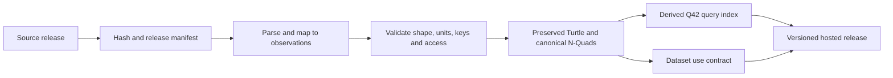

# Web Civics profile: data and QualiaDB WASM contract

Status: draft 0.1. This profile turns the decision-evidence plan into a portable input/output contract for civics.au and related projects. Its machine-readable manifest is [profile.json](../../../data/web-civics-profile/profile.json); the comprehensive requirement catalogue is [dataset-requirements.json](../../../data/web-civics-profile/dataset-requirements.json).

## Why a profile is required

Yes. QualiaDB WASM provides useful parsing, querying, numerical and logic capabilities, but it cannot determine whether a data value is suitable for a particular decision. A Web Civics profile specifies what each input means, how it is admitted, which operations are permitted, and what a report must retain for review. It prevents a graph query or a calculation from becoming an unsupported policy conclusion.

The profile is deliberately reusable. A community-ground case, a local-energy case and a local-commerce case share evidence and reporting rules while retaining their own domain modules.

## Dataset catalogue

The catalogue contains 22 requirements across provenance, population context, housing/support, economy, creative activity, recovery, innovation, digital commerce, engineering, climate, energy, disaster resilience, economics, equity and outcome learning. A requirement names the decision use, decision stage and permitted access class, then maps to one or more candidate sources in the existing research catalogue. It is not a claim that a source is currently admitted or that every field should be collected.

| Access class | Handling rule |
|---|---|
| Public aggregate | Retain release provenance and geographic/time limitations; do not infer an individual. |
| Governed local | Use a stated purpose, owner, update process and local review. |
| Restricted consent | Collect the minimum needed for a specific service or research purpose, with consent, access control, retention and withdrawal rules. |
| Restricted minimised | Aggregate or de-identify where possible; do not use a composite score for eligibility, safety or housing priority. |

Personal circumstances such as relationship breakdown, workplace harm, financial distress, migration status or recovery needs are context for voluntary support design. They must never become a broad intake dataset or an automated determination of a person's worthiness. The model first uses aggregate statistics to understand place-level need; individual information is admitted only where a person has a clear service relationship and protection.

## Interchange and storage

| Purpose | Required representation |
|---|---|
| Application forms, UI state and report layout | ordinary JSON (`application/json`) |
| Semantic case, release, observation and policy data | JSON-LD first; Turtle, N3 and N-Quads accepted for RDF / Solid workflows |
| Evidence identity | RDF Dataset Canonicalization (RDFC-1.0) followed by SHA-256 |
| Efficient derived transport | CBOR-LD after a standards-conformant implementation is demonstrated |
| Present Qualia compact binary | `application/vnd.qualia.nquin-cbor`; vendor format until its parser/serializer contract is resolved |
| Indexed runtime product | Q42, compiled from preserved source and never the only copy |
| Rules/formulas | VibeScript source plus versioned bytecode only after source, bytecode and result agree |

JSON-LD is the primary web boundary because it remains readable in a Node-built site, is standard RDF-compatible, and can be transformed into storage- or transport-oriented forms. CBOR-LD and Q42 are derived performance formats, not a substitute for source evidence. See the [JSON-LD 1.1 Recommendation](https://www.w3.org/TR/json-ld11/), [CBOR-LD Working Draft](https://www.w3.org/TR/cbor-ld-10/) and [RDFC-1.0 Recommendation](https://www.w3.org/TR/rdf-canon/).

## Required input contract

Every profile implementation accepts these typed inputs:

1. **CaseDefinition** — decision, authority, place, affected groups, baseline, alternatives, timeframe, price basis and non-negotiable safeguards.
2. **DatasetRelease / ObservationBatch** — publisher, source URL, retrieval time, reference period, licence or restriction, hash, geography, unit, schema and mapping version.
3. **ParameterSet / Scenario** — a value, unit, uncertainty/range, owner and applicability; operator-finance, fiscal and social-economic accounting remain separate.
4. **RuleSet / VibeProgram** — source, version, permitted capabilities, test fixtures and interpretation. A rule must not silently read data beyond the declared access envelope.
5. **DataAccessEnvelope** — purpose, legal/consent basis, fields, recipients, retention, de-identification status and access decision.

The admission gate rejects an unprovenanced release and reports missing metadata rather than inventing an answer. Browser discovery mode is read-only and may present source context. A verified evaluation must have validated shapes, tested rules, fixed data versions and an explicit capability record. Native bridge mode may add capabilities only when it preserves the same receipt contract.

## Scriptable ETL and hosted dataset products

Each source family needs a versioned transformation configuration, not one-off import code. The [transformation template](../../../data/web-civics-profile/transformation-template.json) declares the acquisition format, primary key, field-to-ontology mapping, suppression handling, shape checks, failure conditions, output products and publication path. It is the ETL recipe that a Node CI job or a separately controlled release worker executes.

### Accepted source formats

| Source family | Examples | ETL treatment |
|---|---|---|
| Delimited tables | CSV, TSV | Stream records, preserve header/row number and source encoding. |
| Workbook tables | XLSX, XLS, ODS | Select declared sheets/ranges; retain workbook hash, sheet name, cell/range locator, displayed value and formula/value distinction. Do not treat formatting or hidden sheets as data without an explicit mapping. |
| JSON APIs and files | JSON, JSON-LD, API responses | Record request URL, parameters, response headers, pagination/cursor and JSON Pointer for each source value. |
| Statistical exchange | SDMX, JSON-stat, PX/Statistical API responses | Preserve dataset, dimension codes, measure, unit, status/suppression flags and release revision. |
| Geospatial | GeoJSON, GeoPackage, Shapefile, WFS | Retain feature ID, CRS, geometry provenance and boundary edition; map geography separately from the observation value. |
| Columnar/large tables | Parquet, Arrow | Read declared columns and partitions; retain schema and partition predicate. |
| RDF | Turtle, N-Triples, N-Quads, RDF/XML | Preserve source graph and named-graph context before applying the Web Civics mapping. |
| XML | XML, RSS/Atom or agency-specific feeds | Record namespace-aware path and source document locator. |
| Publication tables | PDF/HTML tables | Use only where an authoritative machine-readable release is unavailable; retain page/table/cell locator and require human review before admission. |

The configuration's `input.parser` enumerates these families. A later adapter implementation may use appropriate Node libraries, but every adapter must emit the same intermediate records: release metadata, a stable source locator, mapped fields, parse warnings and a raw-file hash. The browser does not ingest arbitrary workbooks directly for evaluation; it consumes reviewed, versioned products hosted by the site.

### Bounded, resumable transformation

Every transformation configuration declares a chunking policy. The starter profile limits a chunk to **10,000 records or 16 MiB**, whichever is reached first, checkpoints every 1,000 records, and uses the source hash plus declared primary key as the resume key. Adapters process one chunk, validate and write its staged RDF/manifest, release memory, then continue. They do not concatenate all rows, observations or RDF strings in process memory.

For a workbook, the chunk boundary is normally a declared sheet/range row interval. For CSV/TSV it is a streamed record count/byte limit; for paginated APIs it is a page or cursor; for Parquet it is a row group; for geospatial data it is a feature batch; and for RDF it is a bounded triple/quad batch. The source ordering and chunk policy are part of the release manifest so retrying an import produces the same sequence.

Each chunk receives its own input hash, mapped-record count, validation report, output hashes and status (`pending`, `processing`, `completed` or `failed`). The final release manifest records the ordered chunk manifest hashes and is published only after every required chunk completes. A failed or changed source release starts a new release ID; it never silently mixes chunks from different source hashes.

The required pipeline is:

The public release directory should contain `dataset-manifest.json`, validation/admission reports, the use contract, Turtle, canonical N-Quads and—only where permitted—the Q42 volume. Each file is immutable, versioned and SHA-256-addressed. The manifest must state the Q42 compiler version, capability profile and the hashes of its RDF inputs so a hosted `.q42` file can be reproduced instead of trusted merely because it was downloaded from the site.

The [use-contract template](../../../data/web-civics-profile/use-contract-template.json) is the companion to ETL. It specifies an indicator's definition, unit and scope; permitted and prohibited uses; parameterised query shapes; model-input admission; report labels; retention; and steward review. This is what lets an evaluator know how to use a dataset without assuming that all available values are suitable for every claim.

The current bundled QualiaDB WASM package has JSON/CSV/Turtle/CBOR-LD parsers but no exported RDF-to-Q42 compiler. Therefore Q42 publication is specified as an optional derived product with the required capability `compile-rdf-to-q42-wasm`; the site must not publish it until that export exists and passes round-trip fixtures. The preserved semantic products are sufficient for development and audit in the meantime. Run `npm run web-civics:etl:check` to validate the templates and their catalogue linkage.

## Required output contract

Every execution produces typed outputs, each linked to its case and run identifier:

- **AdmissionReport** and **ValidationReport** identify accepted, rejected and incomplete material inputs.
- **QueryResult**, **CalculationResult** and **ReasoningTrace** provide values, units, supporting/counter evidence, rules, exceptions and uncertainty.
- **RunReceipt** freezes engine/profile versions, code/rule hashes, input/release hashes, query IDs, calculation IDs, clock time and capability mode.
- **ReportPackage** contains a human-readable report plus the receipt, source inventory, assumptions, results, limitations, dissent/review record and decision record.

Issued reports remain immutable. A later source update or changed scenario produces a new run and report revision instead of overwriting the earlier conclusion.

## QualiaDB WASM implementation boundary

**Preferred package (25 Sep 2026):** QualiaDB Cargo feature `wasm-webcivics` — a decision-evidence profile that ships JSON-LD / SHACL / modal logic / SPARQL kernels and Civics stats/econ receipts **without** `gpu-runtime` (no WebGPU viewport, no GGUF/MoE/LLM). **Solid RDF Source media types** are first-class: `text/turtle`, `application/ld+json` (incl. compact pinned `@context`), and `text/n3`, with `serialize_rdf_wasm` / `parse_rdf_document_wasm` / `solid_negotiate_accept_wasm`. **Device storage:** OPFS primary vault (`webcivics/`) plus a user-linked backup folder (`webcivics-backups` or host Documents path) so site-data clears remain recoverable — see `runtime.deviceStorage` and Qualia `docs/js/webcivics-device-storage.js`. Pinned artifact: `docs/pkg/webcivics/qualia_webcivics_bg.wasm` (2.75 MiB raw / 0.95 MiB gzip); digests in Qualia `docs/releases/0.0.39-wasm-digests.md`. Machine-readable binding: [profile.json](../../../data/web-civics-profile/profile.json) `runtime.preferredCargoFeature` / `runtime.artifact` / `runtime.solid` / `runtime.deviceStorage`. Node fixtures: Qualia `docs/tests/webcivics-solid-rdf.test.mjs`, `docs/tests/webcivics-device-storage.test.mjs`.

The older checked-in **full** 0.0.39 playground bundle can parse Turtle/N3, run SPARQL and exercise numeric SHACL facets, scientific functions and logic exports. That remains useful for discovery demos, but it is the wrong production shape for Civics: it pulls GPU/LLM weight into the browser. Prefer `wasm-webcivics` for Node CI and browser evaluation adapters.

A full Web Civics **verified-evaluation** mode still needs: provenance-preserving JSON-LD ↔ vendor-nquin-cbor round-trips under the admitted profile, graph SHACL as the admission gate on the pinned artifact (not only Rust unit tests), stable rule execution receipts, resource limits, and — only when exported — `compile-rdf-to-q42-wasm` for optional hosted Q42 (today Q42 stays optional/derived; preserved Turtle/N-Quads are sufficient). These remain named in the [QualiaDB development register](12-qualia-wasm-development-register.md); the profile records capability mode so a report cannot imply that an unavailable validation took place.

## Acceptance fixtures for the profile

1. A valid public aggregate release compiles from JSON-LD, canonicalises, validates its declared shape and receives a receipt.
2. A release without a licence, hash, mapping version or geography is rejected with actionable errors.
3. A restricted record cannot be queried outside its access envelope.
4. A VibeScript calculation returns the same declared result in browser WASM and Node CI, or the run fails.
5. A report can be independently regenerated from its case, admitted releases, parameters, rules and receipt.

Run `npm run web-civics:check` to check the manifest, the source mappings and required input/output declarations locally.
